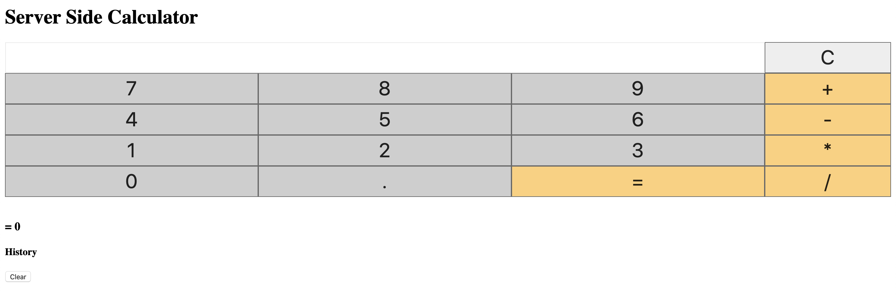

# Server Side Calculator

## Description

_Duration:_ _Weekend_ _Challenge_

A calculator where all calculations are performed in the server, and each calculation is logged in the history as well.

## Screen Shot

## Usage

1. Enter numbers into the input fields
2. Select operation method
3. Click "=" to calculate

## License

[MIT](LICENSE.txt)
